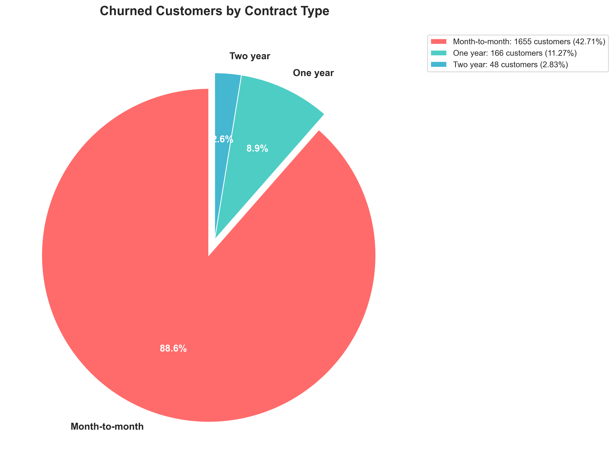

# Customer Churn Analysis

Analyzed 7,032 telecom customers to figure out why people cancel their service and what we could do about it.

## What I Found

Contract type makes the biggest difference:
- Month-to-month customers: 42.7% churn rate
- Two-year contracts: 2.8% churn rate

That's a 15x difference. Also found that new customers (0-6 months) churn at 51%, while long-term customers (37+ months) only churn at 6%. Payment method matters too—electronic check users churn at 45% vs 15% for credit card auto-pay.

Built a Random Forest model that predicts churn with 85% accuracy. Identified about $358K in annual revenue we could save by targeting high-risk month-to-month customers.

## How to Run

```bash
pip install -r requirements.txt
jupyter notebook
```

Run the notebooks in order: `01_data_exploration.ipynb` through `04_dashboard_prep.ipynb`. Each one builds on the previous.

## Tools Used

Python (pandas, scikit-learn, matplotlib), SQL (SQLite with CTEs and window functions), Excel for final reports.

## Technical Notes

Used SQL window functions to calculate running totals and customer metrics—much cleaner than nested subqueries. The main challenge was dealing with class imbalance (73% of customers don't churn), so I used `class_weight='balanced'` in the Random Forest model.

Feature engineering made a bigger difference than hyperparameter tuning. Creating tenure groups and service counts as features improved accuracy more than tweaking max_depth or n_estimators.

SQLite doesn't have some PostgreSQL window functions, so I had to do certain aggregations in Python instead. Not ideal but it worked.

## Sample Visualizations




## What's Next

Could improve this with survival analysis to predict *when* customers will churn, not just if they will. Also want to compare XGBoost/LightGBM—they usually beat Random Forest on tabular data.

## Contact

**Md Imran Hossain**
- Portfolio: [connectimran.netlify.app](https://connectimran.netlify.app)
- LinkedIn: [linkedin.com/in/mdimranhossain118](https://linkedin.com/in/mdimranhossain118)
- Email: imranhossain.moh@gmail.com